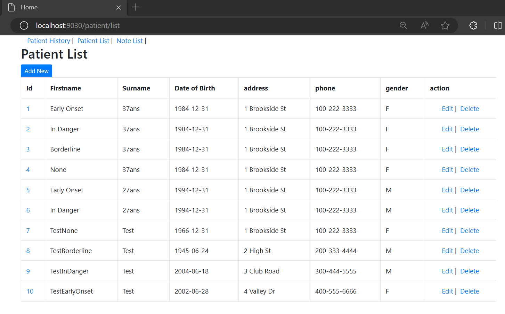
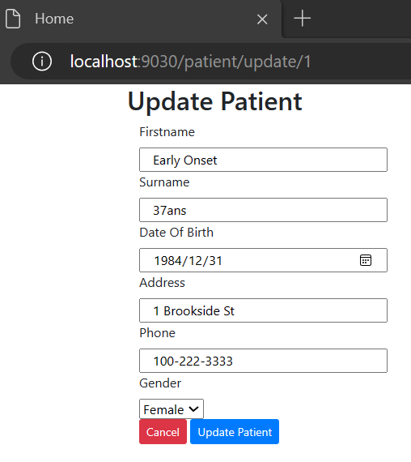
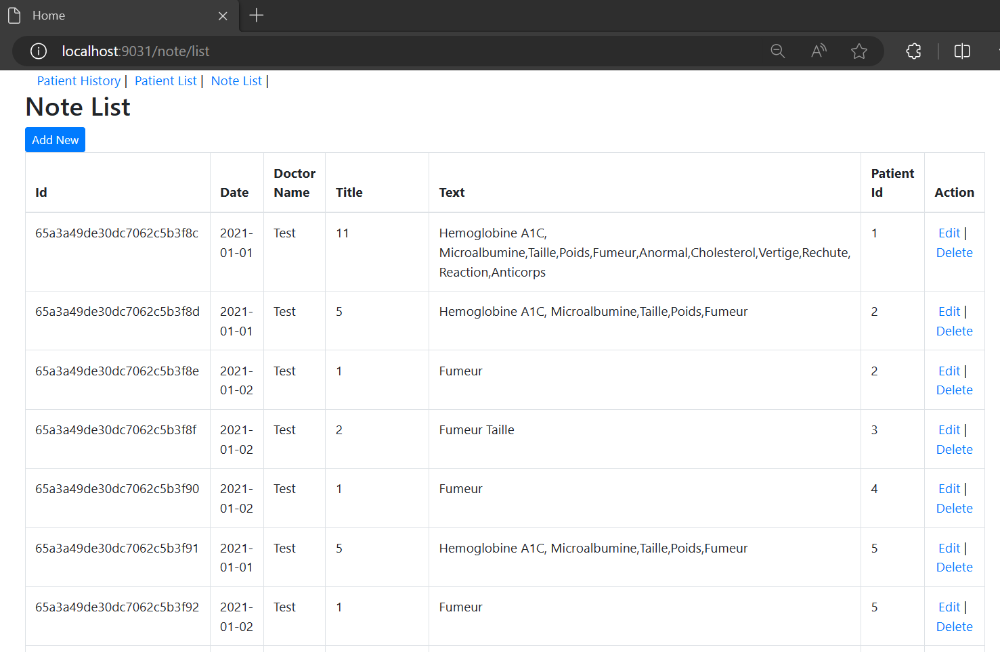
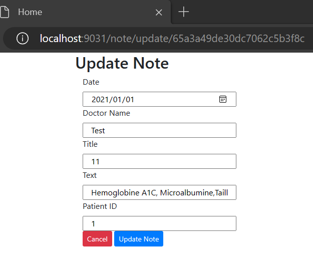
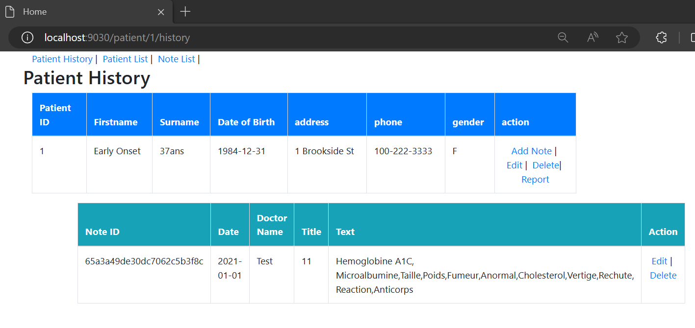
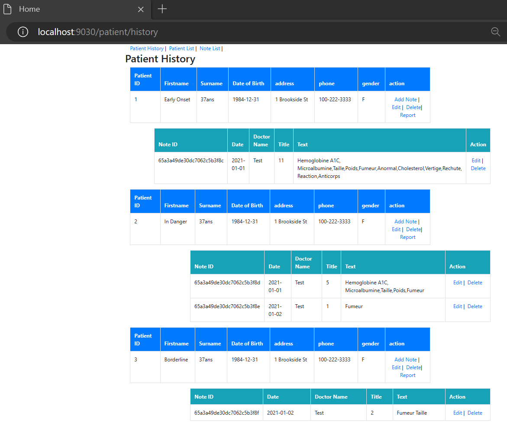

This is the solution for the Java Development training from Openclassroom's project : "Build microservices solution for your clients"
https://s3.eu-west-1.amazonaws.com/course.oc-static.com/projects/DAJava_P9/V2/sce%CC%81nario+-+De%CC%81veloppez+une+solution+en+microservices+pour+votre+client.pdf

# Overview 
## Context
You have recently joined the technical team of an international company that collaborates with health clinics and private practices to detect disease risks. While the technical team is mainly located at the company's headquarters, you were hired as a remote developer, operating in a different time zone. Despite the significant time difference preventing you from attending meetings, you have managed to stay on track by regularly communicating with the product owner through email and an internal chat tool.

## Problems/Needs:
The primary challenges revolve around the coordination of development tasks due to the time zone difference and remote work. You are tasked with creating features to help detect diabetes risks in a project divided into three sprints. The initial focus is on setting up a Docker-based microservices infrastructure to access patient records via RESTful implementation. As a remote developer, effective communication and collaboration are crucial, particularly in documenting progress and meeting sprint deadlines.

## Solutions:

### Sprint 1:
Objective: Establish a Docker-based microservices infrastructure for accessing patient records.
Tasks:
- Implement RESTful microservices for patient record access.
- Utilize provided test cases for system testing.
- Leverage SQL database communication with Spring Boot.
- Document API specifications using REST API model.
Outcome: Deployable microservice for the Docker environment, laying the foundation for subsequent sprints.

### Sprint 2:
Objective : Enhance the system to accommodate notes and observations from medical practitioners in an unstructured format.
Tasks :
- Develop a deployable microservice for managing unstructured notes from medical providers.
- Implement interface with NoSQL database for storing medical notes.
- Update REST API documentation to reflect new functionalities.
Outcome: Deliver a deployable microservice for managing medical notes, satisfying client requirements outlined in the feedback received.

### Sprint 3:
Objective: Develop a Docker-deployable service predicting a patient's diabetes risk level based on demographic data and medical notes.
Tasks:
- Implement risk prediction logic based on specified rules.
- Include patient demographic data in the risk assessment.
- Utilize provided triggers in medical notes to determine risk levels.
- Complete API documentation to cover new functionalities.
Outcome: Deployable service providing diabetes risk predictions, meeting client expectations and concluding the project successfully.

### Kanban supporting the development process :
https://www.notion.so/5655bf2b599047ce8b1d3fd3b3e10f2a?v=f0d40ff9c21e4bf196af6887f732bc78

# spring-boot
## Technical:

1. Framework: Spring Boot v2.2.7
2. Java 8
3. Docker

## Build app

Do the following commands in each folders (Patient, Note, Report)

```mvn 
mvn clean install
```

## Build image with Docker

After all jar compiled, do the following commands to build docker image for (Patient, Note, Report)

```Powershell commands
cd Patient
docker build -t patient .
cd ../Note 
docker build -t note .
cd ../Report
docker build -t report .

cd ..
docker-compose up
```


## Run app with Docker

Go to the root of the folder, where there is docker-compose.yml
Make sure you are logged in

```Powershell commands
docker login

cd ..
docker-compose up
```


## Access page
Make sure all docker containers are up and running then go to :
http://localhost:9030/patient/list 

## Data example
Copy paste content from "data.txt" in a command windows to add data

## Demo : Create, Read, Update, Delete operations on Patient records, and Note records. 

Get the list of the patient, or add a new one : 


You can also edit the information of the patient, by clicking on the number of the "id" column :


Get the list or add new notes : 


Edit or associate note on a specific patient :


Get an overview of the patient and its notes associated :


Get all the history of all patients
